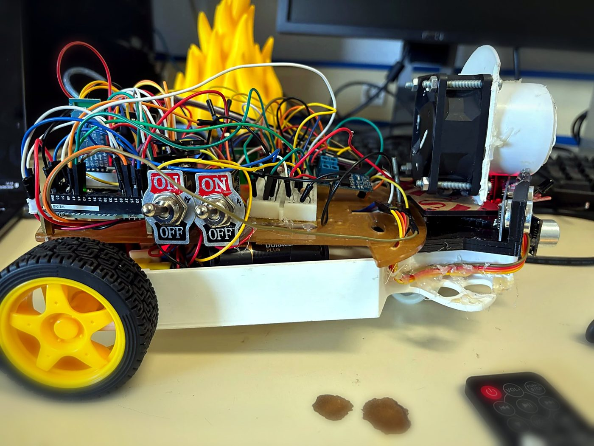
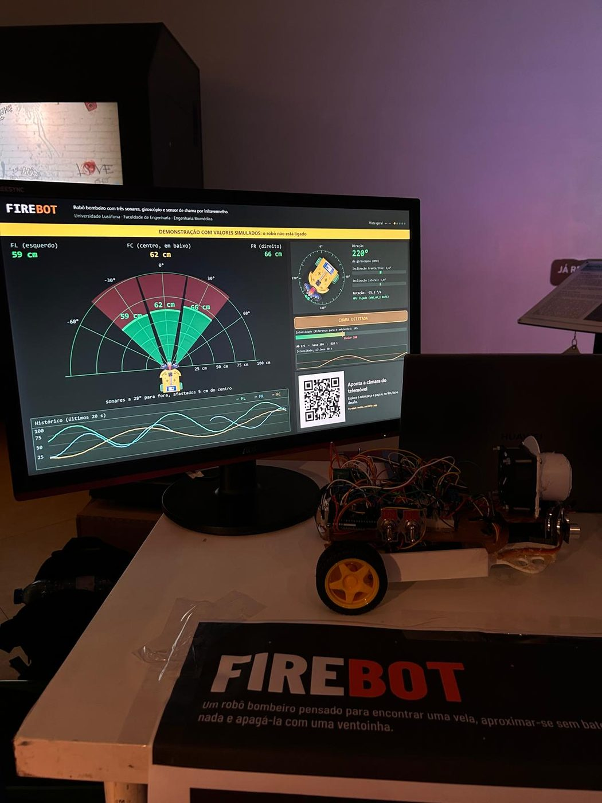

# FIREBOT

Autonomous fire-fighting robot. In a room with obstacles it searches for a
flame, approaches it without hitting anything, puts it out with a fan, and
returns to its starting point on a gyroscope heading.

Built for Elementos de Robótica in the Biomedical Engineering degree at
Universidade Lusófona, Faculdade de Engenharia. Presented publicly at Noite dos
Investigadores 2026 on 25 September, with an A3 poster and a live
demonstration.



## The mission

1. **Search.** Turn slowly until the flame sensor picks up the infrared from
   the candle.
2. **Approach.** Drive forward, using the three sonars to avoid obstacles.
3. **Extinguish.** Stop near the candle and run the fan.
4. **Return.** Head back on the gyroscope heading.

The target is a simulated candle, built for the purpose: a 3D-printed flame
over flickering LEDs with an infrared emitter inside. The flame sensor responds
between roughly 760 and 1100 nm, so the test target has to emit in that band to
be detectable at all. The candle program is in `firmware/vela/`.

## Layout

```
firmware/
  missao-autonoma/   full mission and maze solving (v8.3)
  telemetria/        demonstration build, telemetry and commands
  vela/              simulated candle program
app-pc/              C# desktop application
docs/                components, wiring, pin map, state machine,
                     assembly, calibration and power (in Portuguese)
media/               A3 poster and photographs
```

### firmware/missao-autonoma

The 1341-line autonomous build. A sixteen-state machine, where `BUSCA`,
`LOCALIZAR`, `APROXIMAR`, `EXTINGUIR` and `RETORNAR` carry the mission and the
rest cover maze mode, manual driving, calibration and the per-module test
states. It includes a servo scheduler per state, adaptive speed, a confidence
counter that requires five consecutive confirmations before committing to a
flame, and a basic map of the maze printed over serial at the end of each run.

### firmware/telemetria

A separate 996-line build written for the public demonstration. It reports
every sensor ten times a second, one line per frame, carrying the three sonar
ranges, flame intensity against its calibrated ambient baseline, heading, pitch
and roll, both battery rails, and the motor and fan duty. Output goes to USB
and the radio at the same time, and commands are accepted from either.

Two failure behaviours are worth knowing before changing anything: motors stop
by themselves 500 ms after the last command, so a dropped link stops the robot
rather than leaving it driving; and a module that is not connected is reported
as absent instead of halting the loop, so a robot missing a sensor still
demonstrates everything else.

Keeping the two builds separate was deliberate. It allowed the version that
faced an audience to be made conservative without touching the code carrying
the autonomous mission.

### app-pc

A C# application drawing the sonar returns as a radar, along with heading, the
flame channel and the motor controls. It connects over BLE to a BT24 module
through the FFE1 data channel. The firmware treats that radio as an ordinary
serial port, which is why the same command set works over cable and over the
air. It compiles with the .NET Framework `csc` against the Windows `.winmd`
files with no SDK installed, so it runs from a folder on any machine.



## Hardware

Arduino Mega 2560, three HC-SR04 sonars, an InvenSense-family gyroscope, a 16×2
I2C display, an infrared flame sensor, a MOSFET-driven fan, an infrared
receiver for the remote, warning LEDs and a buzzer, and two independent
supplies, one for the motors and one for the logic.

The full list, with quantities, pins and assembly notes, is in
[`docs/COMPONENTES.md`](docs/COMPONENTES.md) and
[`docs/LIGACOES.md`](docs/LIGACOES.md).

**On the gyroscope part number.** The firmware does not assume one. It reads
`WHO_AM_I` at register 0x75 and accepts 0x68 (MPU-6050) as well as 0x70 and
0x71 (MPU-9250/6500), which is why `mpu.testConnection()` from the MPU6050
library was replaced with a manual check: that call only recognises 0x68. The
telemetry build scans the bus and publishes whatever it finds as `WHO:<hex>`,
so the part actually fitted is identified at boot rather than in a parts list.

**On the documentation.** The files in `docs/` were written for an earlier
phase, the line follower with extinguisher, and differ from the build shown in
September on some details: they give the side sonars at 30° where the poster
gives 28°. They remain the most complete assembly and calibration reference
that exists, but check against the hardware before taking any single value
literally.

## Status

The autonomous mission was completed and tested on the first build. What ran in
front of the public was the telemetry firmware, the demonstration build.

From the test table on the poster: motors and wheel direction validated, all
three sonars validated, gyroscope and I2C display validated, data to the PC at
ten per second over cable and two per second over Bluetooth, stop without
commands from the application in 0.5 s, and fan soft-start validated. **The
flame sensor is marked for replacement**: its sensitivity and field of view
were the limiting factor on reliable detection range, and it is the first thing
to change.

## What I learned

Connecting each module unpowered and checking polarity first avoids shorting
the 5 V rail. With two supplies, the grounds have to be tied together or the
signals share no reference. Testing module by module against live telemetry
isolates a fault in seconds, where testing the assembled mission only tells you
that something, somewhere, went wrong; the telemetry firmware was written for
the demonstration and turned out to be the best diagnostic tool in the project.

## Author

André Oliveira Massuça. Biomedical Engineering, Universidade Lusófona,
Faculdade de Engenharia.

[andremassuca.com](https://andremassuca.com) ·
[ORCID 0009-0005-1527-843X](https://orcid.org/0009-0005-1527-843X)

## Licence

MIT. See [LICENSE](LICENSE).
